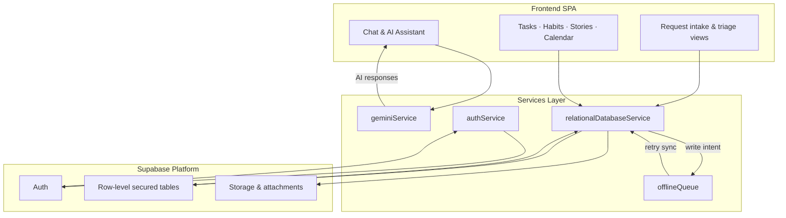

<div align="center">
  <h1>Taskly Chat</h1>
  <p>A fast, local-first productivity app with Tasks, Habits, Notes, Projects, Files, Calendar, and an optional AI assistant.</p>
</div>

Taskly.Chat blends a clean, efficient SPA for personal productivity with a broader product vision: an AI-powered companion that remembers, adapts, and helps you move from conversation to action. This README focuses on the SPA you’re running now and includes a product overview for context.

## Contents

- Overview and core identity
- Features at a glance
- Quick start (dev, build, preview)
- Optional AI setup (Gemini)
- Folder structure
- Deployment (GitHub Pages CI included)
- Troubleshooting and FAQ

## Overview

Taskly Chat is a React + Vite + TypeScript single-page app. It runs fully in the browser with LocalStorage persistence—no backend required. The optional AI assistant (Gemini) activates only if you provide an API key.

### Core identity (product vision)

- Vision: Be the central hub where ideas, tasks, and goals—personal or professional—come together seamlessly.
- Mission: Help you capture, structure, and accomplish what matters by blending intelligent assistance, persistent memory, and a conversational experience.

## Features

- Guest try-before-signup experience that mirrors the Auth SPA in a ChatGPT-style layout
- Unified toolbar across Tasks, Habits, and Stories (project/category selectors, period/status toggles, right-side extras)
- Consistent cards, headers, modals, and empty states
- Stories: list + kanban board with drag-and-drop; full-page story editor
- Tasks: KPIs (Completed/Overdue/Todo/Total), quick filters (Today/Week/Month)
- Habits: streaks and completion rate, 7-day view, recurrence
- Notes: simple rich text, attachments, “note to tasks” extraction
- Calendar and Files pages
- **Microsoft Calendar Integration**: Sync Outlook/Teams calendars via OAuth 2.0 (see [MICROSOFT_CALENDAR_QUICKSTART.md](./MICROSOFT_CALENDAR_QUICKSTART.md))
- Requests: intake form, prioritization board, and update timeline synced to Supabase
- Collaboration: shared projects with invites, member roles, and live updates
- Authentication: email/password, magic links, and password reset powered by Supabase Auth
- Offline queue with local fallbacks; sync once connectivity returns
- Optional Gemini AI integration for drafting and assistance
- **Optional Microsoft Calendar integration** for Outlook/Teams event syncing

## Guest + marketing experiences

- **Guest workspace** — Anonymous visitors land in `components/guest/GuestExperience.tsx`. They can chat with the AI and create up to five trial tasks. The session persists in `sessionStorage` via `services/guestSessionService.ts` so refreshing keeps progress intact.
- **Automatic migration on signup** — After successful authentication, guest chats/tasks are imported into the signed-in account (see `App.tsx`, look for the `guestSessionService` effect). A toast confirms the import and the guest storage key is cleared.
- **Marketing entry points** — Static HTML shells (`about.html`, `features.html`, `contact.html`) each load a dedicated Vite entry (`about.tsx`, `features.tsx`, `contact.tsx`). All pages share `components/marketing/MarketingLayout.tsx` for consistent navigation and footer styling. Update the copy in `components/marketing/*.tsx` to iterate quickly without touching the SPA shell.
- **Linking back to the app** — Primary CTAs call `redirectToAppAuth`, which opens the main SPA with `?login=open` so users see the signup modal instantly.

⚠️ **Authentication Setup:** If you're experiencing login timeouts, see [SUPABASE_AUTH_SETUP.md](./SUPABASE_AUTH_SETUP.md) for fixing email rate limit issues.

## Pricing and plans (October 2025)

Taskly.chat now offers four tiers so folks can start small and scale up without friction:

| Plan | Price | Designed for | Highlights |
| --- | --- | --- | --- |
| Free (Starter) | $0 | Individuals exploring Taskly without a commitment | 50 tasks, 5 habits, 2 projects, list view, manual reminders |
| Lifetime Basic Unlock | $29 one-time | Personal users who dislike subscriptions | Unlimited personal usage, Light AI suggestions (5/day), sync across devices |
| Pro | $10 per member / month | Power users and small teams collaborating with Smart AI | Unlimited everything, request-to-story conversion, Smart AI co-pilot, calendar sync, limited Kanban, priority support |
| Enterprise | Custom | Larger orgs needing governable AI workflows | Advanced story workflows, unlimited SpecKit sessions, Requests 2.0, admin console, SSO, integrations, dedicated success |

🆕 The marketing site at `components/LandingPage.tsx` reflects this pricing, showcases calmer layout patterns, and highlights workflow narratives and social proof to reduce “boxy” UI.

## Requests pipeline & collaboration

- **Intake** — `components/RequestIntakeForm.tsx` guides stakeholders through product, problem, outcome, and value prompts. Attach files, pick desired timelines, and flag required expertise.
- **Triage views** — `RequestsListPage.tsx` and `RequestsBoardPage.tsx` offer list + Kanban tracking for status, priority, and ownership. Filters (“My requests”, “Needs review”) live in `utils/useRequestsFilters.ts`.
- **Updates log** — `RequestIntakeForm` and `RequestUpdate` sheets record follow-ups in `services/relationalDatabaseService.addRequestUpdate` so history survives across teammates.
- **Story handoff** — Convert a request into a story or checklist via `NoteToTaskModal` / `StoryEditorPage` workflows; linked IDs stay in sync.
- **Collaboration controls** — `ProjectDetailsView` + `ProjectLinkModal` surface invites, while `services/authService.ts` ensures only authenticated members can join.

## Tech stack

- React 19, TypeScript, Vite
- Tailwind-style utility classes (via className utilities)
- LocalStorage for persistence
- Optional AI: Google Gemini via `@google/genai`

## Services & utilities overview

| Area | Responsibilities | Key files |
| --- | --- | --- |
| Authentication | Email/password, magic link, Google OAuth, session listeners | `services/authService.ts`, `components/AuthModal.tsx` |
| Supabase client & RLS | Initialize client, ensure RLS policies respected via helpers like `has_project_access` | `services/supabaseClient.ts`, `supabase/schema.sql` |
| Relational sync | CRUD for projects, requests, stories, habits, notes, events, conversations with offline replay | `services/relationalDatabaseService.ts`, `services/offlineQueue.ts` |
| Migration | Promote local state into relational schema for existing users | `services/migrateToRelational.ts` |
| Requests intake & triage | Intake form, views, filters, updates log | `components/RequestIntakeForm.tsx`, `components/RequestsBoardPage.tsx`, `components/RequestsListPage.tsx`, `utils/useRequestsFilters.ts` |
| AI assistance | Gemini prompts for task generation, summaries, SpecKit | `services/geminiService.ts`, `components/AIAssistantPanel.tsx` |
| Metrics & pulse | Lightweight metrics dashboards and pulse notifications | `services/metricsService.ts`, `services/pulseService.ts`, `components/PulseWidget.tsx` |

## Architecture at a glance



### From idea to shipped outcome

1. **Capture** — Conversations in `ChatView` or `AIAssistantPanel` create structured notes, tasks, or intake drafts.
2. **Request** — Stakeholders formalize needs through `RequestIntakeForm`, attaching files and desired timelines.
3. **Triage** — `RequestsBoardPage` and `RequestsListPage` prioritize work, logging updates for transparency.
4. **Promote** — Approved requests convert into Stories, checklists, or calendar events, syncing via `relationalDatabaseService`.
5. **Execute** — Teams track delivery across Tasks/Habits/Kanban while Gemini aggregates summaries for leadership.
6. **Sync & report** — Supabase stores the authoritative record; `metricsService` and `pulseService` emit digests and dashboards.

## Quick start

Prerequisites: Node.js 18+

1) Install dependencies

```bash
npm install
```

2) Run in dev

```bash
npm run dev
```

3) Build for production

```bash
npm run build
```

4) Preview the production build

```bash
npm run preview
```

### Previewing static marketing pages locally

After `npm run build`, open `dist/about.html`, `dist/features.html`, or `dist/contact.html` in a browser (or use `npm run preview` and navigate to `http://localhost:4173/about.html`, etc.). These pages are self-contained and deploy alongside the SPA bundle.

## Optional AI setup (Gemini)

Add a `.env.local` at the repo root:

```env
VITE_API_KEY=your_gemini_api_key
# Optional: set a base path for GitHub Pages or subpath hosting
# PUBLIC_BASE_URL=/taskly.chat/
```

Notes:
- If not provided, AI features are disabled gracefully.
- The app reads `import.meta.env.VITE_API_KEY` in code paths that require AI.
- This app uses text-based Gemini capabilities only; it does not accept image inputs.

## Folder structure

## Optional: Supabase sync and relational DB

Add a `.env.local` with:

```env
VITE_SUPABASE_URL=your-project-url
VITE_SUPABASE_ANON_KEY=your-anon-key
# Optional: enable relational DB reads/writes (still writes JSON app_state for compatibility)
VITE_USE_REL_DB=true
```

Then run the SQL in `supabase/schema.sql` in your Supabase project. It includes both the legacy `app_state` table and a normalized schema with row-level security.

### What Supabase unlocks

- **Authentication** via `services/authService.ts` — email/password, email magic links, Google OAuth, and email verification flows.
- **Collaboration** tables (`project_users`, `project_invites`) with helper policies (`has_project_access`, `has_project_admin`) so members only see what they’re invited to.
- **Requests intake** (`requests`, `request_updates`) powering `RequestsBoardPage`, `RequestsListPage`, and the AI-enabled `RequestIntakeForm`.
- **Relational sync** for tasks, habits, notes, calendars, stories, files, conversations, and preferences through `services/relationalDatabaseService.ts`.
- **Offline queue** (`services/offlineQueue.ts`) that captures writes while offline and replays them when Supabase reconnects.

### Enabling auth & collaboration

1. Configure Supabase URL/Anon key as above.
2. Optionally set `VITE_SUPABASE_SERVICE_ROLE` in secure server environments for background jobs.
3. Enable email auth + Google OAuth in Supabase dashboard. Redirect URI should be `https://<your-domain>/auth/callback` (or `http://localhost:5173/auth/callback` in dev).
4. Seed `profiles` table with your user once and rely on the provided RLS helpers to gate access.

The UI components `AuthModal`, `OnboardingWizard`, and the project invite modals automatically respect these settings.

> ℹ️ **RLS & helper functions**: The SQL for `has_project_access`, `has_project_admin`, request policies, and invite token handling lives in `supabase/schema.sql`. Review the `-- helpers` and `-- policies` sections before modifying access rules or adding new tables so you stay consistent with existing security helpers.

Migration: open DevTools Console and run `window.__taskly_migrate && window.__taskly_migrate()` while signed in to upsert your current in-memory state to the relational tables.

```text
taskly.chat/
├─ components/           # UI pages and shared components
│  ├─ ListsView.tsx      # Tasks
│  ├─ HabitsView.tsx     # Habits
│  ├─ NotesView.tsx      # Notes editor
│  ├─ StoriesView.tsx    # Stories (list + kanban)
│  ├─ StoryEditorPage.tsx# Full-page editor for stories
│  ├─ UnifiedToolbar.tsx # Shared filters/toolbar
│  └─ ...
├─ services/
│  ├─ geminiService.ts   # Optional Gemini integration
│  └─ pulseService.ts
├─ App.tsx
├─ index.tsx
├─ index.html
├─ types.ts              # Shared app types
├─ vite.config.ts
├─ tsconfig.json
└─ package.json
```

## Deployment

### GitHub Pages (CI/CD)

This repo includes a GitHub Actions workflow at `.github/workflows/deploy.yml` that builds the app and deploys `dist/` to GitHub Pages on pushes to `main`.

Setup steps:
1. In your repository Settings → Pages, set:
   - Source: GitHub Actions
2. Optionally set a custom domain under Settings → Pages.

The workflow uses Node 20, runs `npm ci` and `npm run build`, and publishes the `dist/` output. If you’re deploying under a subpath (e.g., `https://<user>.github.io/<repo>`), you can set a base path using an environment variable:

```env
PUBLIC_BASE_URL=/taskly.chat/
```

The Vite config reads `PUBLIC_BASE_URL` to set the `base` option.

### Other hosts

- Netlify: drag-and-drop the `dist/` folder or point to `npm run build` and `dist` as the publish directory.
- Vercel: import the repo; framework: Vite; build: `npm run build`; output: `dist`.
- Any static host works by serving `dist/`.

## Troubleshooting and FAQ

- Dev server port busy: Vite automatically picks the next available port.
- Big bundle warning: It’s safe. For production-sensitive deployments, consider code-splitting via Rollup `manualChunks`.
- Blank page on GitHub Pages: Ensure `PUBLIC_BASE_URL` matches your repo name (e.g., `/taskly.chat/`) and the Pages settings are using GitHub Actions.

---

Made with care for a smooth, consistent productivity workflow.
